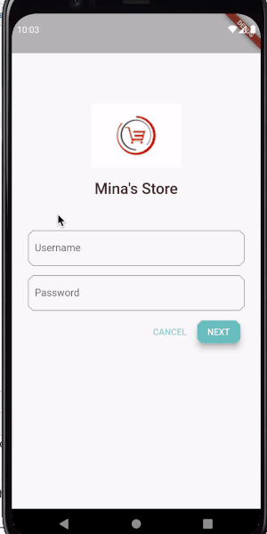

# Mina's Store

A fultter project to demonstrate a shopping cart application.

# Functionality

1. Implement a dummy login page for the Application.
2. Show list of products in a horizontal scroll like manner.
3. App uses a Custom Animated Backdrop Menu UI for navigating through different product category options.
4. User can add any number of products multiple times into the shopping cart.
5. User can search through product repository.
6. User can view their current items in the cart along with their total cost.

# Implementation

